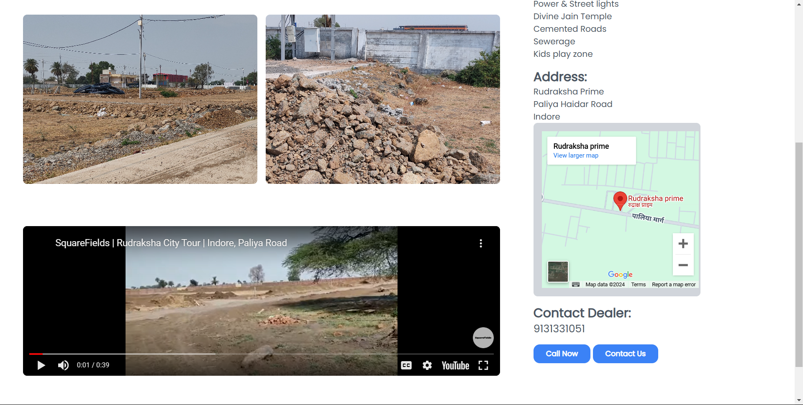
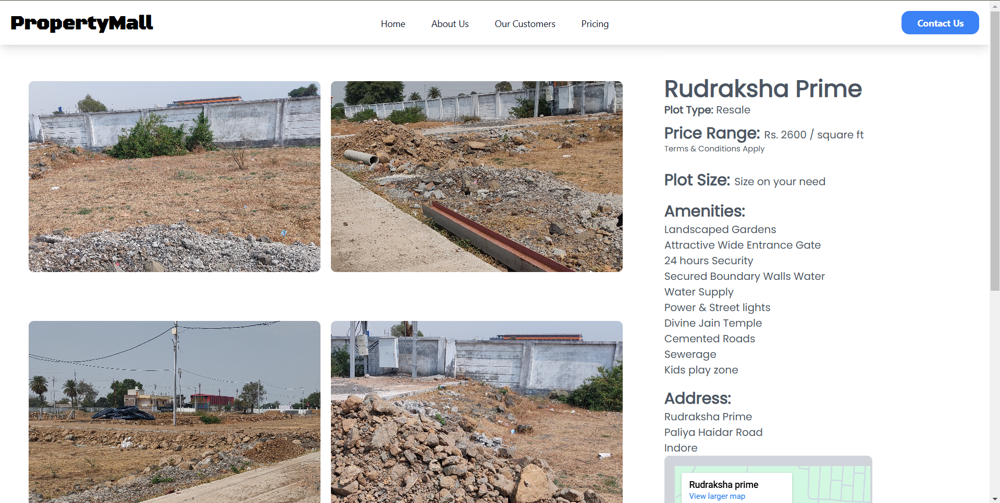
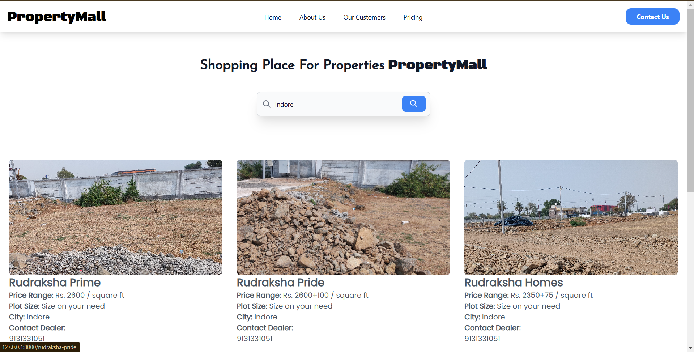
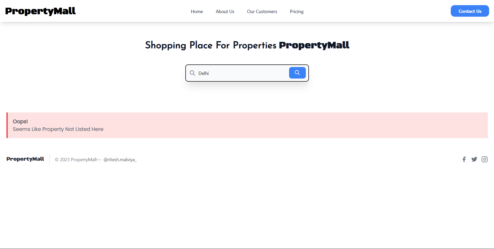
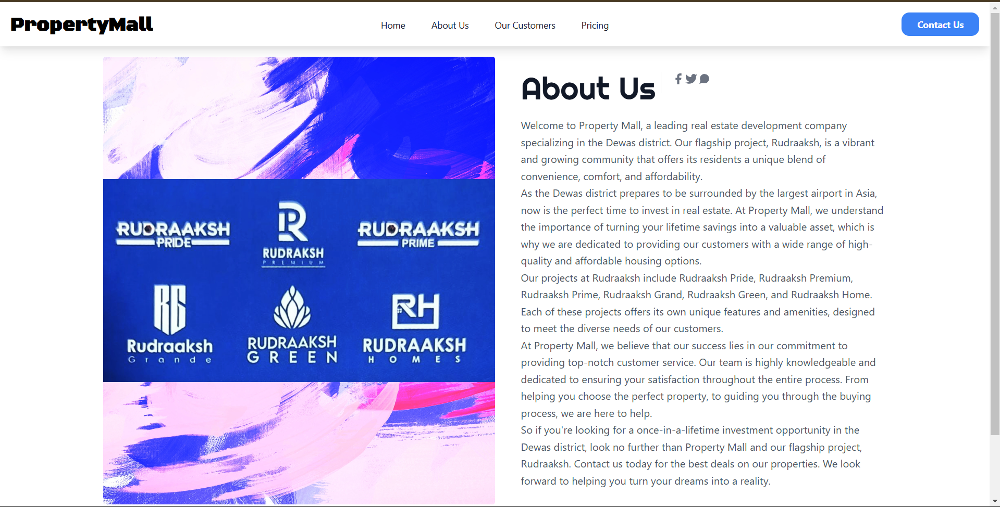
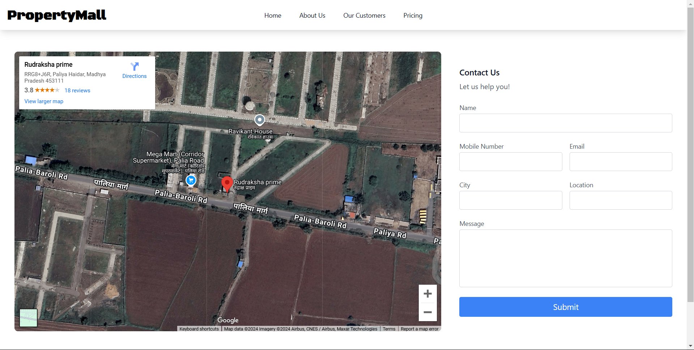
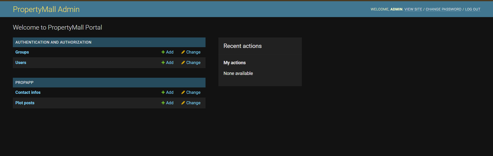

# PropertyMall

**PropertyMall** is a marketplace application built using Django that connects people who are looking for plots or houses. This platform allows users to browse and list properties, making it easier to find and offer real estate listings.

## Features

- **Property Listings**: Users can list available plots and houses with details like price, location, and description.
- **Search & Filter**: Users can search for properties based on location, price range, and property type.
- **Property Details**: Each property listing has detailed information, including images and contact details.
- **User Interaction**: Interested users can contact property owners through the platform.

## Admin Portal Features

### 1. **Property Management**
   - Admins can **list properties** by adding details such as price, location, type (plot or house), description, and images.
   - The properties listed by users are managed from the admin portal where admins can approve, edit, or delete listings as required.

### 2. **Customer Queries via Contact Form**
   - The admin portal allows the admin to view customer queries submitted through the **contact form**.
   - Admins can respond to these queries directly through the portal or via email.

### 3. **Email Notifications (SMTP)**
   - When a customer submits a query through the contact form, an **email notification** is sent to the admin, informing them of the new submission.
   - SMTP is configured to send these notifications, ensuring the admin is promptly notified about any customer queries.

## Technologies Used

- **Django**: Backend framework for creating the web application.
- **SQLite**: Default database for storing data. Can be replaced with PostgreSQL or MySQL for production.
- **TailwindCSS**: Frontend framework for styling and responsive design.

## How it looks and works
Home Page

Property Page

Search Results

About Page

Contact Page

Admin Portal

