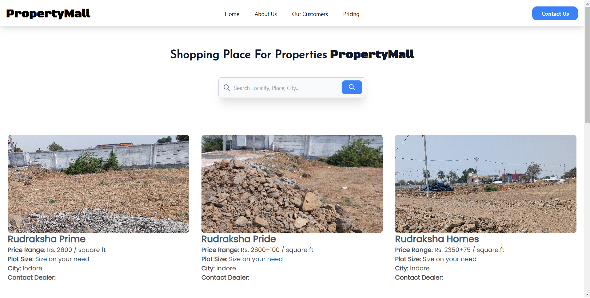

# PropertyMall

**PropertyMall** is a marketplace application built using Django that connects people who are looking for plots or houses. This platform allows users to browse and list properties, making it easier to find and offer real estate listings.

## Features

- **Property Listings**: Users can list available plots and houses with details like price, location, and description.
- **Search & Filter**: Users can search for properties based on location, price range, and property type.
- **Property Details**: Each property listing has detailed information, including images and contact details.
- **User Interaction**: Interested users can contact property owners through the platform.

## Technologies Used

- **Django**: Backend framework for creating the web application.
- **SQLite**: Default database for storing data. Can be replaced with PostgreSQL or MySQL for production.
- **TailwindCSS**: Frontend framework for styling and responsive design.

## How it looks and works

